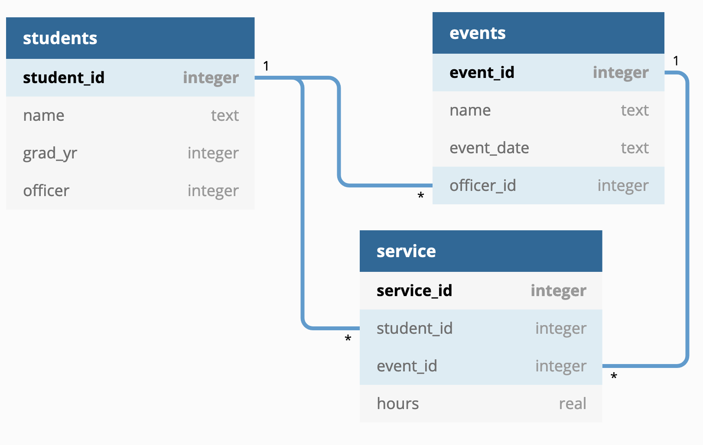

# Key Club Database CLI

The North Bergen High School chapter of [Key Club International](https://www.keyclub.org/) needs you to automate
its tracking of student volunteer hours. Additionally, the club needs to submit monthly and annual reports summarizing their service to the community. You will design the database and implement a simple command line interface for adding data and generating reports.

## Database
`keyclub.sqlite` is a [SQLite](https://sqlite.org) database with the following schema:

For clarification, the `officer` field in the `students` table is a boolean. It will hold a 1 if that student is *currently* an officer and a 0 otherwise. This defaults to 0.

For every school event where Key Club is active, there is always an officer present. Under `events`, the `officer_id` field is the `student_id` of the officer in charge for that event.

## Reports
The database contains the following report views:
- `club_ytd`: A view that totals the service hours for the current service year
- `club_month`: A view that totals the service hours for the current month 
- `ind_ytd`: A view that gives the total hours for each member of the club for the current service year
- `officer_ytd`: A view that gives the total hours for each officer in the club for the current service year
- `top_ten`: A view that gives the top ten volunteers and their total service hours for the current service year
